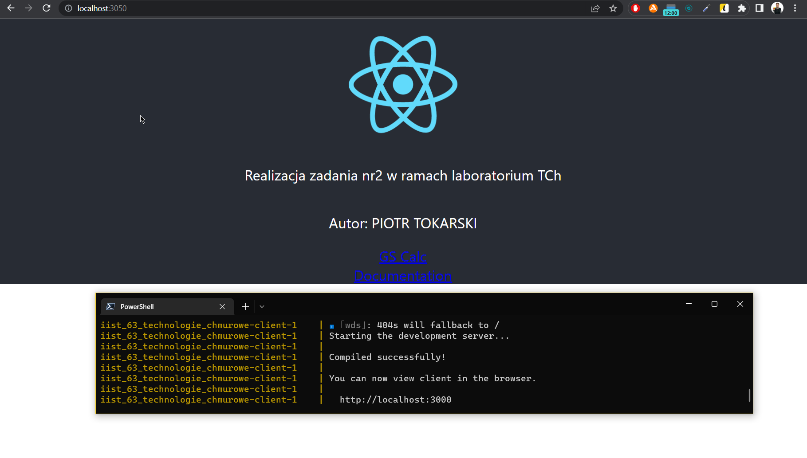

# README - wersja rozwojowa

## Budowa obrazów

Aby zbudować obrazy, należy wykorzystać narzędzie docker-compose z plikiem wersji rozwojowej - `docker-compose.dev.yml` używając polecenia `docker compose -f docker-compose.dev.yml build`.

## Uruchomienie usługi

Aby uruchomić usługę w wersji rozwojowej używamy polecenia `docker compose -f docker-compose.dev.yml up`.

## Potwierdzenie działania

W wersji rozwojowej kontener `client` korzysta z serwera rozwojowego `webpack`, co jest widoczne w log'ach.
