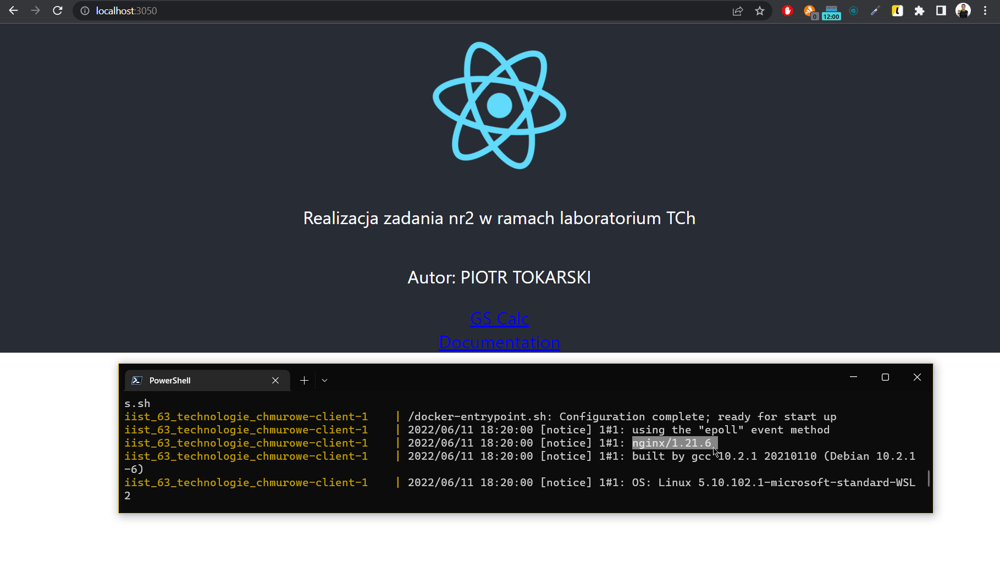

# README - wersja produkcyjna

## Konfiguracja repozytorium

Aby skorzystać z repozytorium obrazów, należy najpierw skonfigurować repozytorium za pomocą zmiennych środowiskowych (np. plik `.env` w katalogu głównym projektu). Obrazy przygotowane w ramach rozwiązania zadania znajdują się na [repozytorium Docker Hub](https://hub.docker.com/repository/docker/piotrtokarski/technologie_chmurowe_zad2). Aby z nich skorzystać należy wykorzystać następującą konfigurację:
```sh
TCH2_REGISTRY_ADDR='docker.io'
TCH2_REGISTRY_USER='piotrtokarski'
TCH2_IMAGE_NGINX='technologie_chmurowe_zad2:nginx'
TCH2_IMAGE_API='technologie_chmurowe_zad2:api'
TCH2_IMAGE_CLIENT='technologie_chmurowe_zad2:client'
TCH2_IMAGE_WORKER='technologie_chmurowe_zad2:worker'
```

## Budowa obrazów

Aby zbudować obrazy, należy wykorzystać narzędzie docker-compose z plikiem wersji produkcyjnej - `docker-compose.yml`:


## Publikacja obrazów


Jak widać wszystko udało się pomyślnie wykonać.

## Uruchomienie usługi

Aby uruchomić usługę w wersji produkcyjnej wpisujemy `docker compose up`.

## Potwierdzenie działania



W wersji produkcyjnej kontener `client` korzysta z serwera `nginx`, co jest widoczne w log'ach.
