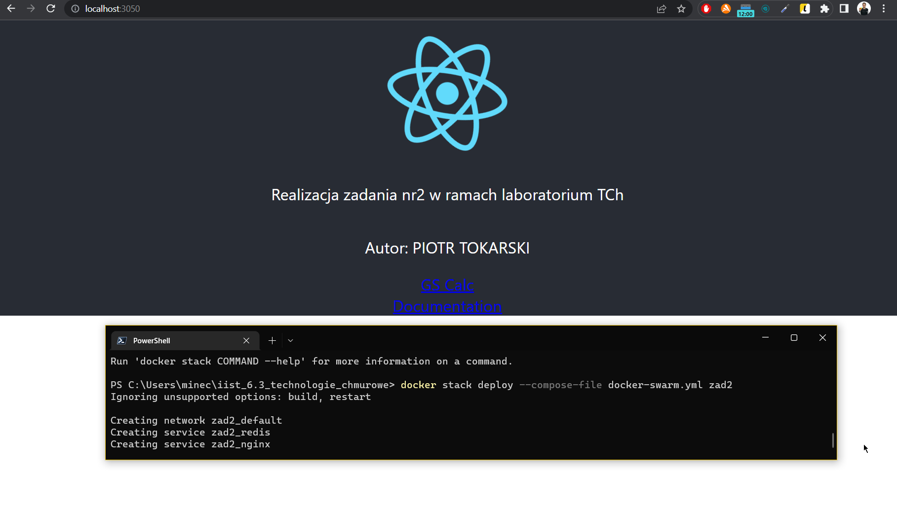

# README - wersja `stack` / `swarm`

## Konfiguracja repozytorium i przygotowanie do uruchomienia

Aby przygotować dostęp repozytorium ustawiamy zmienne środowiskowe.

```ps
$env:TCH2_REGISTRY_ADDR='docker.io'
$env:TCH2_REGISTRY_USER='piotrtokarski'
$env:TCH2_IMAGE_NGINX='technologie_chmurowe_zad2:nginx'
$env:TCH2_IMAGE_API='technologie_chmurowe_zad2:api'
$env:TCH2_IMAGE_CLIENT='technologie_chmurowe_zad2:client'
$env:TCH2_IMAGE_WORKER='technologie_chmurowe_zad2:worker'
```

```ps
PS C:\Users\minec\iist_6.3_technologie_chmurowe> $env:TCH2_REGISTRY_ADDR='docker.io'
PS C:\Users\minec\iist_6.3_technologie_chmurowe> $env:TCH2_REGISTRY_USER='piotrtokarski'
PS C:\Users\minec\iist_6.3_technologie_chmurowe> $env:TCH2_IMAGE_NGINX='technologie_chmurowe_zad2:nginx'
PS C:\Users\minec\iist_6.3_technologie_chmurowe> $env:TCH2_IMAGE_API='technologie_chmurowe_zad2:api'
PS C:\Users\minec\iist_6.3_technologie_chmurowe> $env:TCH2_IMAGE_CLIENT='technologie_chmurowe_zad2:client'
PS C:\Users\minec\iist_6.3_technologie_chmurowe> $env:TCH2_IMAGE_WORKER='technologie_chmurowe_zad2:worker'
PS C:\Users\minec\iist_6.3_technologie_chmurowe> $env:TCH2_REPLICAS=2
PS C:\Users\minec\iist_6.3_technologie_chmurowe> docker swarm init
Swarm initialized: current node (1a4s0q7r3uhcy32rrkc5fz62k) is now a manager.

To add a worker to this swarm, run the following command:

    docker swarm join --token SWMTKN-1-0uzm30jc9b2ftb7176olklwhwfe2200yi8n3ja8jh59lsnrpiy-6zhkibwhf7i91qrehvtgb3fqm 192.168.65.3:2377

To add a manager to this swarm, run 'docker swarm join-token manager' and follow the instructions.
```

```ps
PS C:\Users\minec\iist_6.3_technologie_chmurowe> docker stack deploy --compose-file docker-swarm.yml zad2
Ignoring unsupported options: build, restart

Creating network zad2_default
Creating service zad2_redis
Creating service zad2_nginx
Creating service zad2_api
Creating service zad2_client
Creating service zad2_worker
Creating service zad2_postgres
PS C:\Users\minec\iist_6.3_technologie_chmurowe>
```

## Potwierdzenie działania


